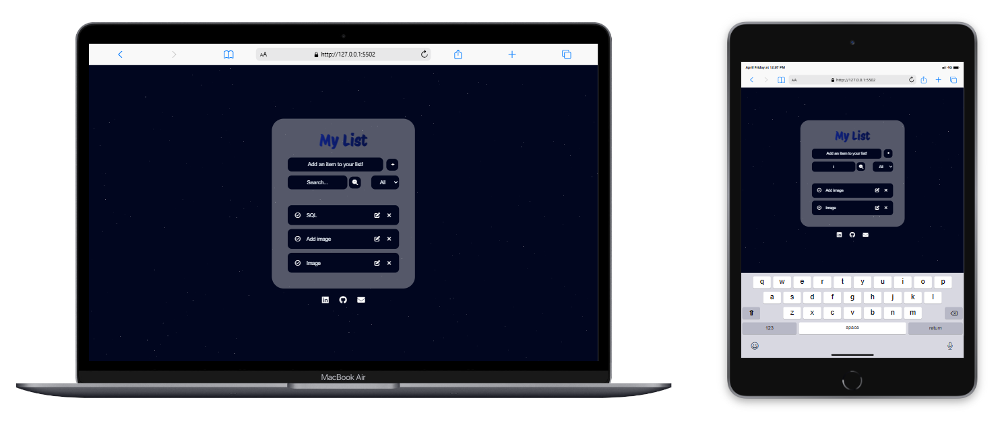

<h1 align="center">MyList | Task Manager</h1>

  <a href="#-project">Project</a>&nbsp;&nbsp;&nbsp;|&nbsp;&nbsp;&nbsp;
  <a href="#-features">Features</a>&nbsp;&nbsp;&nbsp;|&nbsp;&nbsp;&nbsp;
  <a href="#-preview">Preview</a>

  

## 💻 Project
This project is a simple task manager web application, allowing users to create, edit, and search tasks. It provides functionalities like adding, editing, and removing tasks, as well as searching for specific tasks. 

## ✨ Technologies used:
- HTML
- CSS
- JavaScript

## ⚙️ Features
- Create, edit, and remove tasks
- Search functionality to find specific tasks
- Filter tasks by status (all, done, todo)
- Responsive design

## 🔗 Preview
<a href="https://isabelaolsemann.github.io/MyList/" target="_blank">View MyList</a>

---
This project was created by Isabela Olsemann.
